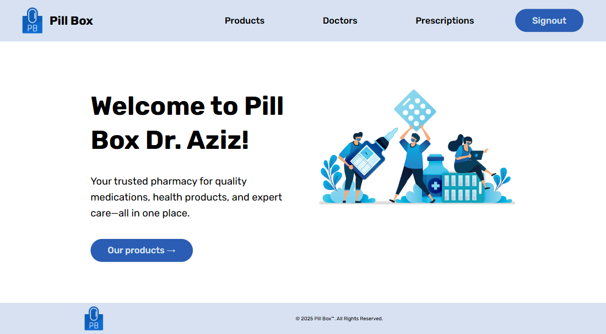

<link rel="stylesheet" href="./public/readme-styles.css">

 
 

**[Pill Box™](https://pill-box.onrender.com/)**  
The Pharamcy You Deserve!
 
 

Pill Box™ is a pharmacy web app that has full CRUD functionality, Authentication and a UI that users will love!

In addition, the app has three models: ( Users model / Medicines model / Prescriptions model ), with each model serving a specific purpose in the pharmacy.
Also, the pharmacy has two types of users: 

- Doctors :
  Can view, add, edit, and delete different products, prescriptions and doctors.

- Patients :
  Can view different products, prescriptions and doctors.

 
 
 
 
 

Designed & Programmed By The Amazing Team of:

<ul style="margin-top: 40px; margin-bottom: 40px; display: flex; align-items: center; justify-content: space-evenly;">
    <li style="display: flex; align-items: center;">
        
        <a href="https://github.com/AhmedAWM">Ahmed Abdulwahab</a>
    </li>
    <li style="display: flex; align-items: center;">
        
        <a href="https://github.com/sedratiaziz">Abdulaziz Sedrati</a>
    </li>
    <li style="display: flex; align-items: center;">
        
        <a href="https://github.com/sharifaaldoseri">Sharifa Al-Doseri</a>
    </li>
    
</ul>

 
 
 
 
 
 

Tech Stack: 
-
- Front end: 

     
     
    
 
 

- Back end:

    
    
    

 
 
 

Planned Future Enhancements: 
-
A future update would add google authentication and dark/light mode toggle functionality.

  